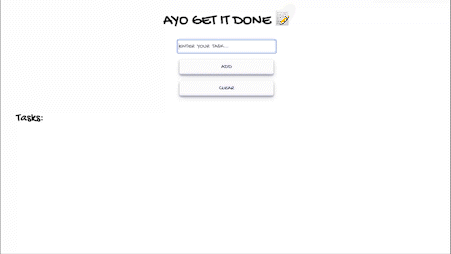

# TO DO LIST

One hour project to learn Flask and Jinja

# TECHNOLOGIES

- HTML
- Jinja
- CSS
- Python
- Flask

# RUN ON YOUR LOCAL MACHINE

- clone this repository to your machine: `git clone https://github.com/flaviaouyang/brutally-minimalistic-to-do.git`
- navigate to the project folder where `wgsi.py` lies: `cd /brutally-minimalistic-to-do`
- run: `flask run` or `python3 wgsi.py`

# DEMO

